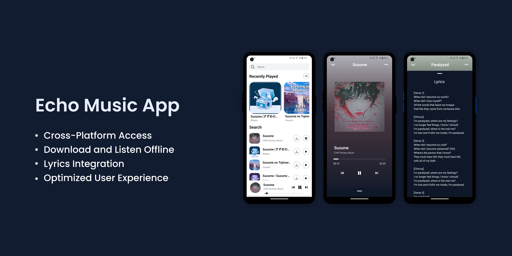

<div align="center">
  <h1>
    Echo Music App
  </h1>
  <br />
    
  <br />
  <br />

  <div>
    
    
    
    
    
  </div>

</div>

## 📋 <a name="table">Table of Contents</a>

1. 🤖 [Introduction](#introduction)
2. ⚙️ [Tech Stack](#tech-stack)
3. 🔋 [Features](#features)
4. 🤸 [Quick Start](#quick-start)

## <a name="introduction">🤖 Introduction</a>

Discover, play, and enjoy music like never before with our all-in-one music app, built on Expo. Whether you're in the mood to explore new tunes, search for your favorite tracks, or sing along with real-time lyrics, Echo has you covered. With features like music streaming, powerful search capabilities, and offline downloads, you’ll always have your favorite songs at your fingertips. Enjoy a seamless and immersive experience designed to keep you connected to the music you love anytime, anywhere.

## <a name="tech-stack">⚙️ Tech Stack</a>

- Expo
- Expo Navigation
- Nativewind
- Zustand
- React query
- TypeScript

## <a name="features">🔋 Features</a>

👉 **Expo Framework**: Built using Expo, providing a robust foundation for cross-platform mobile development on both Android and iOS.

👉 **Expo Navigation**: Integrated smooth and intuitive navigation powered by Expo Navigation for seamless transitions and a cohesive user experience.

👉 **Nativewind Styling**: Styled with Nativewind to combine the power of Tailwind CSS with React Native, ensuring a modern, responsive, and visually appealing interface.

👉 **State Management with Zustand**: Manages global state efficiently using Zustand, making the app faster and more responsive with minimal re-renders.

👉 **Data Fetching with React Query**: Optimized data fetching, caching, and synchronization using React Query, enabling smooth and fast access to music, lyrics, and search results.

👉 **TypeScript Support**: Leveraged TypeScript for enhanced code quality, ensuring type safety and reducing runtime errors across the app.

## <a name="quick-start">🤸 Quick Start</a>

1. Install dependencies

   ```bash
   npm install
   ```

2. Start the app

   ```bash
    npx expo start
   ```

In the output, you'll find options to open the app in a

- [development build](https://docs.expo.dev/develop/development-builds/introduction/)
- [Android emulator](https://docs.expo.dev/workflow/android-studio-emulator/)
- [iOS simulator](https://docs.expo.dev/workflow/ios-simulator/)
- [Expo Go](https://expo.dev/go), a limited sandbox for trying out app development with Expo

You can start developing by editing the files inside the **app** directory. This project uses [file-based routing](https://docs.expo.dev/router/introduction).

## Get a fresh project

When you're ready, run:

```bash
npm run reset-project
```

This command will move the starter code to the **app-example** directory and create a blank **app** directory where you can start developing.
